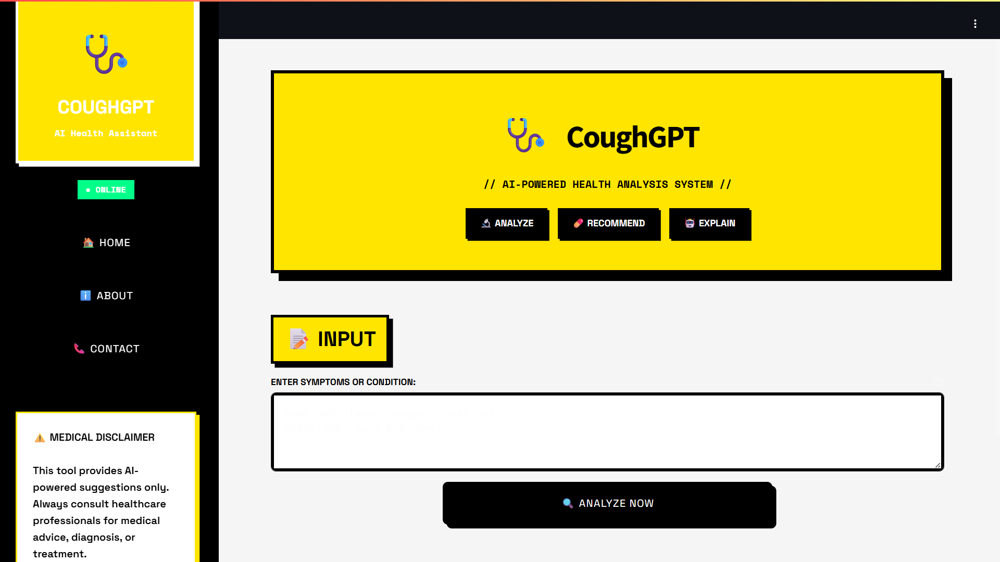
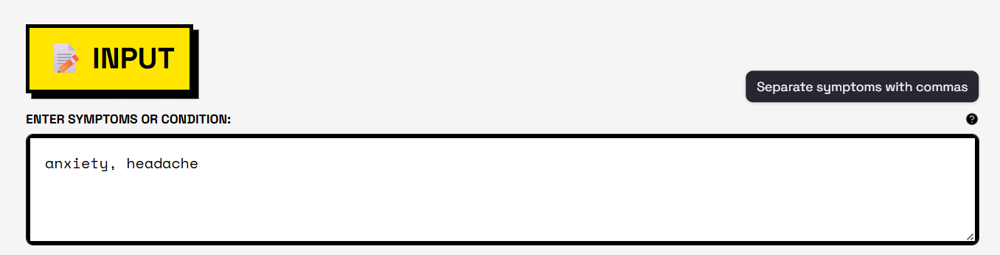
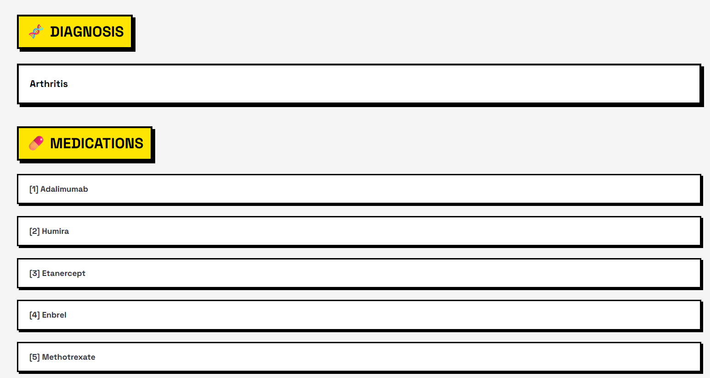
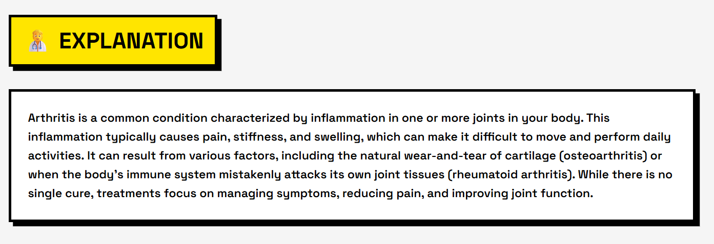
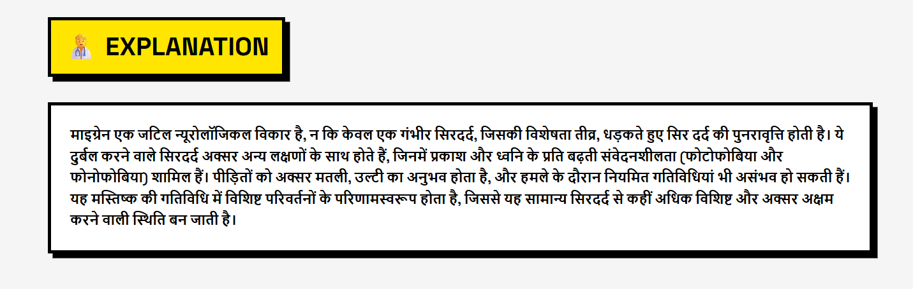
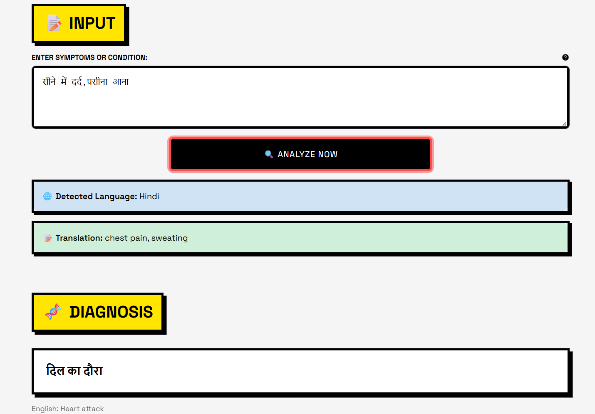
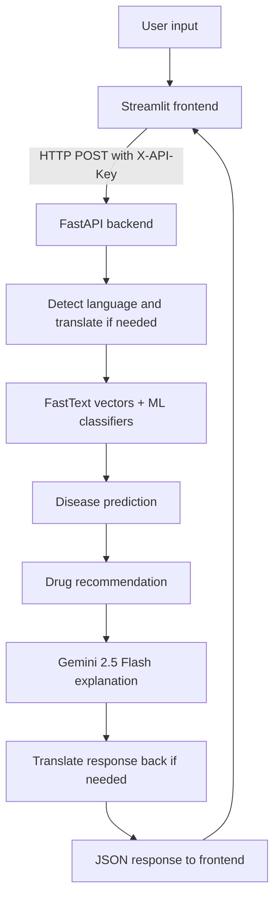

# 🩺 CoughGPT

CoughGPT is an AI health analysis project that takes natural-language symptom descriptions or condition names, predicts a likely disease or medication list, and generates a plain-English medical explanation with Gemini. The app is split into a Streamlit frontend and a FastAPI backend, with language detection and translation built in for multilingual use.

---

> [!CAUTION]
> ## ⚠️ Medical Disclaimer — READ BEFORE USE
>
> **CoughGPT is a student/learning project built purely for educational and demonstration purposes.**
>
> - The disease predictions and drug recommendations generated by this application are **NOT medically verified**, **NOT clinically validated**, and **must NOT be used for self-diagnosis or self-medication**.
> - The AI model outputs are based on limited training data and can produce **incorrect, incomplete, or misleading results**.
> - **Do NOT take any medication** based on what this app suggests. **Always consult a qualified medical professional** for health concerns, diagnosis, and treatment.
> - The creators of CoughGPT are **not medical professionals** and accept **no responsibility or liability** for any actions taken based on the outputs of this application.
> - If you are experiencing a medical emergency, **call your local emergency services immediately**.
>
> **Use this project only to explore how ML pipelines and LLM integrations work — not as a health tool.**

---

## 📸 Screenshots

### Home Page

The landing page features a bold neobrutalist design with quick-access feature cards and a live backend health indicator.

<p align="center">
	
</p>

---

### Symptom Input

Users describe their symptoms in natural language. The system accepts input in multiple languages and auto-detects the language before processing.

<p align="center">
	
</p>

---

### Disease Prediction & Drug Recommendation

After analysis, CoughGPT displays the predicted condition along with a list of commonly associated medications pulled from the drug review dataset.

<p align="center">
	
</p>

---

### AI-Generated Explanation

Gemini 2.5 Flash generates a concise, easy-to-understand explanation of the predicted condition — covering what it is, common symptoms, and general guidance.

<p align="center">
	
</p>

---

### Multilingual Support

CoughGPT detects the input language automatically and translates both the query and the response, enabling use in Hindi and other supported languages.

<p align="center">
	
</p>

<p align="center">
	
</p>

---

## 🧠 Overview

CoughGPT is designed as a fast, modular health assistant with three core capabilities:

1. Disease prediction from comma-separated symptom input.
2. Drug recommendation based on the predicted condition.
3. AI-generated explanation of the result using Google Gemini.

The system also detects the user's language, translates non-English input to English for analysis, and translates the final response back to the original language when needed.

## 🏗️ Architecture



## ✨ Key Features

- FastAPI backend with startup model loading through a lifespan context manager.
- X-API-Key authentication for protected endpoints.
- Language detection using `langdetect`.
- Translation using `deep-translator`.
- Disease prediction with FastText embeddings and a trained classifier.
- Drug recommendation from the drug review dataset.
- Medical explanation generation using Google Gemini 2.5 Flash.
- Streamlit frontend with a neobrutalist UI and multi-page navigation.

## 🛠️ Tech Stack

| Layer | Technology |
|-------|-----------|
| Frontend | Streamlit |
| Backend | FastAPI |
| NLP / Embeddings | FastText, Gensim |
| ML | Scikit-learn, Joblib, NumPy, Pandas |
| Language Tools | langdetect, deep-translator |
| AI Explanation | Google Generative AI (Gemini 2.5 Flash) |
| Dataset | UCI ML Drug Review dataset |

## ⚙️ How It Works

The backend performs the full pipeline in a single `/api/analyze` call:

1. Detect the input language.
2. Translate to English if necessary.
3. Decide whether the input is a symptom list or a condition name.
4. Predict the disease for symptom input, then derive recommended drugs.
5. Call Gemini for a short medical explanation.
6. Translate the explanation back to the user's language when required.

## 🚀 Setup

### 1. Install dependencies

Install the backend requirements first:

```bash
pip install -r backend/requirements.txt
```

If you want to run the frontend from a separate environment, install the Streamlit dependencies listed in `frontend/requirements.txt` as well.

### 2. Configure environment variables

Copy the example env file and fill in your keys:

```bash
cp backend/.env.example backend/.env
```

Required variables:

```bash
API_SECRET_KEY=your-secret-key
GEMINI_API_KEY=your-gemini-api-key
COUGHGPT_BACKEND_URL=http://127.0.0.1:8000
```

### 3. Run the backend

```bash
uvicorn backend.main:app --host 127.0.0.1 --port 8000 --reload
```

### 4. Run the frontend

```bash
streamlit run frontend/app.py
```

## 📡 API Endpoints

| Method | Endpoint | Description |
|--------|----------|-------------|
| `GET` | `/api/health` | Backend health check |
| `POST` | `/api/detect-language` | Detect text language |
| `POST` | `/api/translate` | Translate text between languages |
| `POST` | `/api/predict-disease` | Predict disease from symptoms |
| `POST` | `/api/predict-drugs` | Predict medications for condition |
| `POST` | `/api/explain` | Generate Gemini explanation |
| `POST` | `/api/analyze` | Full end-to-end analysis pipeline |

## 📁 Project Structure

```text
backend/
	main.py              FastAPI app and API routes
	auth.py              X-API-Key authentication
	ml_engine.py         Model loading and inference helpers
	schemas.py           Request and response models
	services/
		translator.py      Language detection and translation
		gemini.py          Gemini explanation service
	models/              Trained ML artifacts and training data
frontend/
	app.py               Streamlit UI
docs/
	screenshots/         Project screenshots
backup/                Report assets and older project artifacts
```

## 📝 Notes

- The backend loads ML models once at startup to avoid reloading large artifacts on every request.
- The frontend is UI-only and talks to the backend over HTTP.
- This project is intended for **educational and informational use only** and is **not a substitute for professional medical advice**.

## 📄 License

This project is licensed under the [MIT License](LICENSE).
